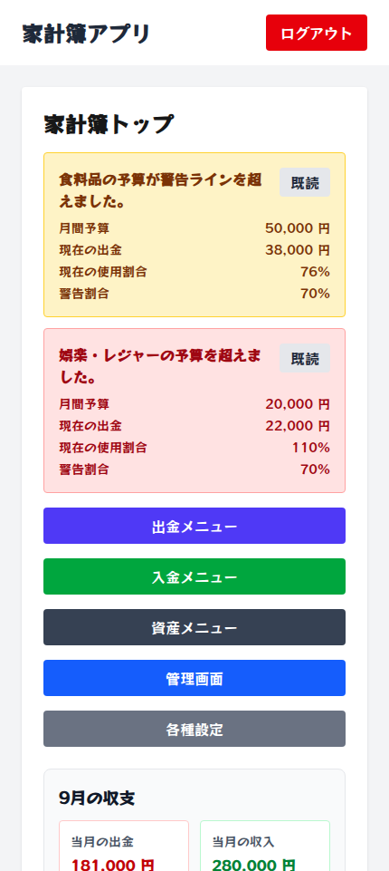
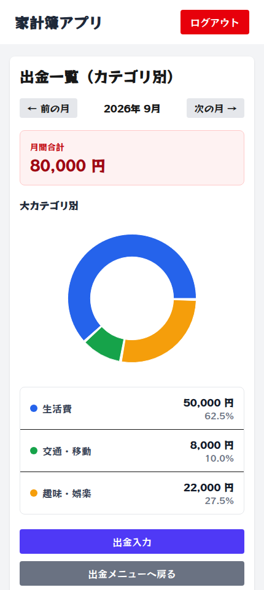
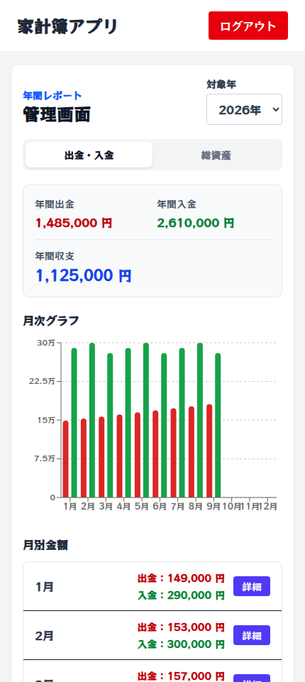

# 家計簿アプリフロントエンド側

Laravel APIと連携し、出金・入金・資産残高・予算アラートを管理するNext.jsフロントエンドです。

## プロジェクト構成

APIとフロントエンドは別々のリポジトリです。ローカルでは、次のように同じ親ディレクトリへ配置できます。

```text
kakeibo-mobile-project/
├── kakeibo-mobile-api/      # Laravel API
└── kakeibo-mobile-front/    # Next.jsフロントエンド（このリポジトリ）
```

- API：[kakeibo-mobile-api](https://github.com/sub-law/kakeibo-mobile-api)
- フロントエンド：[kakeibo-mobile-front](https://github.com/sub-law/kakeibo-mobile-front)

## 主要画面

スクリーンショットには、ローカル環境で作成した公開用の架空データを使用しています。

<table>
  <tr>
    <th>家計簿トップ</th>
    <th>カテゴリ別出金</th>
    <th>管理画面</th>
  </tr>
  <tr>
    <td></td>
    <td></td>
    <td></td>
  </tr>
</table>

## 設計資料

- [画面遷移図](docs/screen-flow.md)
- [各画面とAPIの対応](docs/screen-api-mapping.md)
- [フロント側の認証フロー](docs/authentication-flow.md)

## 🚀 セットアップ手順

### 1. リポジトリをクローン

```bash
git clone <リポジトリURL> <フォルダ名>
cd <フォルダ名>
```

### 2. 依存パッケージをインストール

```bash
npm install
```

---

## 🧰 環境変数の設定

### 3. `.env.local` を作成

Next.js では `.env.local` は Git 管理されないため、各自で作成します。

```bash
touch .env.local
```

`.env.local` に以下を記述：

```
NEXT_PUBLIC_API_BASE_URL=http://localhost/api
```

## 🏃 開発サーバー起動

```bash
npm run dev
Ctrl+Cでターミナルに戻ります
```

## キャッシュクリアコマンド

```bash
rm -rf .next
```

確認用URL：

```
http://localhost:3000
```

---

## 🧪 動作確認

Lintを実行：

```bash
npm run lint
```

自動テストを実行：

```bash
npm test
```

ローカルでプロダクションビルドを確認：

```bash
npm run build
```

認証・トークン有効期限に関する手動確認項目：

- 有効なトークンでログイン後の各画面を利用できる
- トークンがない状態でログインが必要な画面を開くと、ログイン画面へ移動する
- APIが401を返すと、保存されているトークンが削除され、ログイン画面に再ログイン案内が表示される
- APIの一時的な通信エラーや401以外のエラーでは、自動的にログアウトされない
- ログアウトAPIが失敗した場合も、端末上のログイン状態を終了できる

GitHub Actionsでは、`develop`・`main`へのpushとPull Requestを対象に、Node.js v20.19.3で次の処理を実行します。

1. `npm ci`
2. `npm run lint`
3. `npm test`
4. `npm run build`

ワークフローの定義は[`.github/workflows/ci.yml`](.github/workflows/ci.yml)を参照してください。デプロイ処理は含みません。

---

## 設計上の判断

### 状態管理

- ログイン状態はReact Contextで共有し、APIから取得した一覧・フォーム入力・表示状態は各画面のローカルstateで管理しています。現在の規模で必要な状態の範囲を明確にし、追加の状態管理ライブラリは使用していません。
- Bearer Tokenは`localStorage`に保存し、再ログイン案内など一度だけ表示する情報は`sessionStorage`に保存しています。

### 年月処理

- 月次APIには`year`と`month`を明示して送信し、画面遷移時もクエリパラメータで表示対象月を引き継ぎます。
- `YYYY-MM`形式を使う資産残高・月次固定費では入力形式と範囲を検証し、不正または未指定の場合はJSTの現在年月へ補正します。
- 出金一覧や管理画面でも年月クエリを検証し、選択中の年月とAPIへ渡す年月が一致するようにしています。

### 通信エラー対応

- 認証が必要な通信は`authenticatedFetch`へ集約し、Bearer TokenとJSONレスポンス用ヘッダーを共通で付与します。
- API URLの未設定やネットワーク例外は、内部情報を表示しない共通の日本語メッセージへ変換します。
- `401 Unauthorized`では端末上のトークンを削除してログイン画面へ移動します。`401`以外は呼び出し元へ返し、入力エラーや処理失敗を各画面で表示します。
- ログアウトAPIが失敗した場合も、端末上の認証状態は終了します。

---

## 🔐 セキュリティヘッダー

すべての画面レスポンスに、以下のセキュリティヘッダーを設定しています。

- `Content-Security-Policy-Report-Only`
- `X-Content-Type-Options: nosniff`
- `Referrer-Policy: strict-origin-when-cross-origin`
- `Permissions-Policy: camera=(), microphone=(), geolocation=()`
- `X-Frame-Options: DENY`

CSPは現在Report-Onlyで設定されているため、違反したリソースはブロックされません。
ローカル環境のブラウザ開発者ツールで、意図しないCSP違反がないことを確認します。

ローカル環境での確認項目：

- ログイン、ログアウト、期限切れ時の再ログインが正常に動作する
- トップ画面、出金、入金、資産、各種設定画面が正常に表示される
- 管理画面のグラフ、ツールチップ、凡例が正常に表示される
- ローカルAPIとの通信がCSP違反として報告されない
- JavaScript、CSS、フォント、画像について意図しないCSP違反がない
- レスポンスヘッダーに設定した各セキュリティヘッダーが含まれる

`connect-src`には、`NEXT_PUBLIC_API_BASE_URL`から取得したAPIのオリジンが自動的に追加されます。

---

## 📦 動作環境

- Next.js v16.3.5
- React v19.2.4
- TypeScript v5.9.3
- Node.js v20.19.3
- npm v10.8.2

---

## 既知の制約

- 認証が必要な画面の判定はクライアント側で行い、Next.js Middlewareによるサーバー側のルート保護は使用していません。トークンの有効性はAPIの`401`レスポンスで判定します。
- Bearer Tokenは`localStorage`に保存し、リフレッシュトークンは使用していません。期限切れ後は再ログインが必要です。
- CSPはReport-Onlyであり、違反を記録・確認する段階です。ブラウザによるリソースのブロックは行いません。
- 自動テストは共通API通信、年月処理、削除確認モーダル、入金登録時の通信エラー、出金・入金一覧の年月切替競合、出金・入金・固定費登録の二重送信防止を対象とした最小構成です。ブラウザE2Eテストとビジュアルリグレッションテストは導入していません。
- 利用時はLaravel APIを別途起動し、`NEXT_PUBLIC_API_BASE_URL`をローカルAPIのURLに合わせる必要があります。

---

## 📘 補足

- `.env.local` は Git 管理しません
- API URL は Laravel 側のポートに合わせて変更してください
