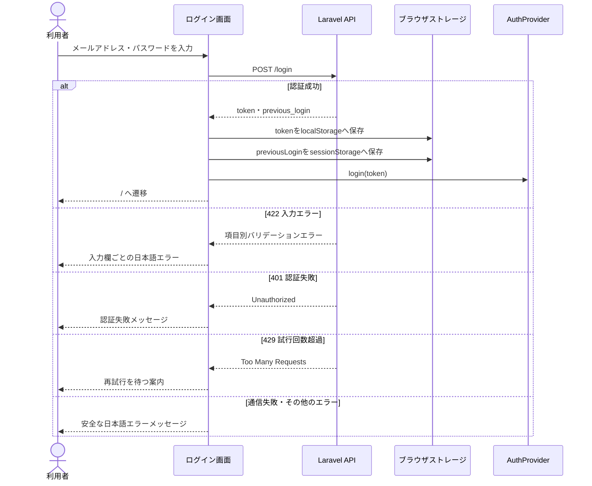
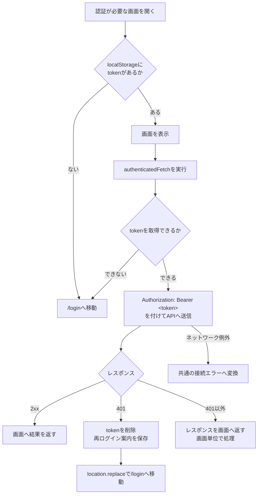
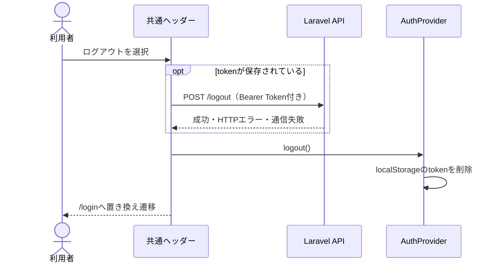
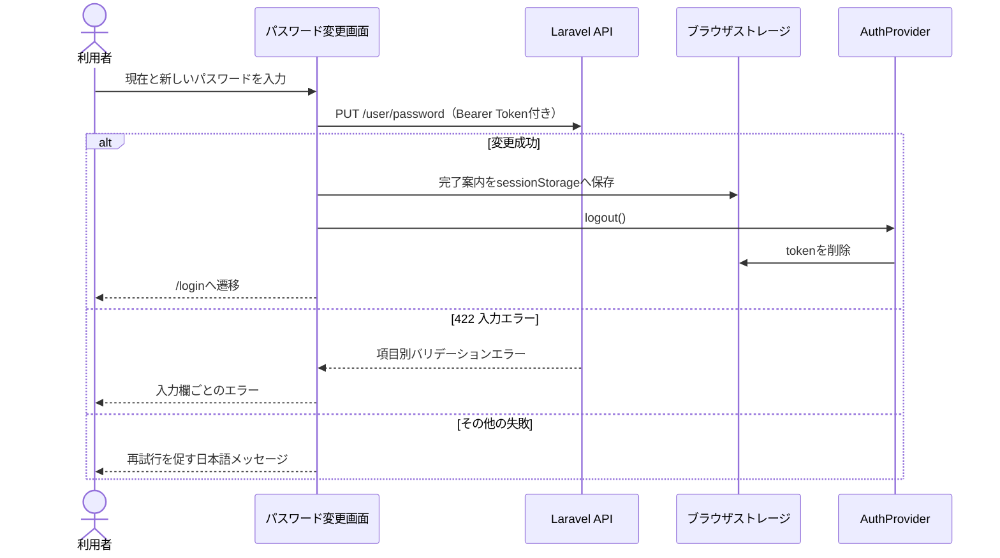

# フロント側の認証フロー

## 構成

フロントエンドはLaravel APIが発行するBearer Tokenをブラウザで保持し、認証が必要なAPIリクエストへ付与します。Cookie認証やフロント側のセッション発行は行いません。

| 役割 | 実装 | 内容 |
| --- | --- | --- |
| 認証状態 | `src/hooks/useAuth.ts` | `localStorage`のトークン有無をReact Contextの`isLoggedIn`へ反映 |
| 画面ガード | `src/components/ClientLayout.tsx` | マウント後にトークンを確認し、未保存なら`/login`へ移動 |
| 認証付き通信 | `src/lib/apiClient.ts` | Bearer Token付与、接続エラー変換、`401`時のログイン誘導 |
| ログイン | `src/app/login/page.tsx` | 認証情報の送信、トークンと前回ログイン情報の保存 |
| ログアウト | `src/components/Header.tsx` | APIログアウトを試行し、結果にかかわらず端末側の認証状態を終了 |
| パスワード変更 | `src/app/settings/password/page.tsx` | パスワード更新成功後に端末側のトークンを削除して再ログインを要求 |

## ブラウザ内の保存先

| キー | 保存先 | 内容 | 削除されるタイミング |
| --- | --- | --- | --- |
| `token` | `localStorage` | APIが発行したBearer Token | ログアウト、パスワード変更成功、トークンなし・`401`の認証リダイレクト |
| `previousLogin` | `sessionStorage` | ログインレスポンスの前回ログイン情報 | 既読化成功、形式不正、タブまたはブラウザセッション終了 |
| `authRedirectMessage` | `sessionStorage` | `401`後にログイン画面で一度だけ表示する案内 | ログイン画面で取得した直後 |
| `passwordChangeSuccess` | `sessionStorage` | パスワード変更後にログイン画面で一度だけ表示する完了案内 | ログイン画面で取得した直後 |

文書内ではトークンを`<token>`と表記し、実際の値は記載しません。

## ログイン

`/login`だけは認証トークンを持たないため、`authenticatedFetch`ではなく通常の`fetch`を使用します。

ログイン成功後、`AuthProvider`の`isLoggedIn`が`true`になり、共通ヘッダーにログアウトボタンが表示されます。ページ再読み込み時は、クライアントの初期表示後に`localStorage`を読み直して認証状態を復元します。

## 認証が必要な画面とAPI通信

`authenticatedFetch`の共通処理は次のとおりです。

1. `localStorage`から`token`を取得します。
2. トークンがなければ端末側のトークンを削除し、`/login`へ移動します。
3. `Authorization: Bearer <token>`と`Accept: application/json`を設定します。
4. `NEXT_PUBLIC_API_BASE_URL`と相対パスを結合してAPIへ送信します。
5. API URL未設定またはネットワーク例外は、詳細を露出しない共通の接続エラーへ変換します。
6. `401`ではトークンを削除し、再ログイン案内を`sessionStorage`へ保存して`/login`へ置き換え遷移します。
7. `401`以外のHTTPレスポンスは呼び出し元へ返し、各画面が成功・入力エラー・処理失敗を判定します。

複数のAPI呼び出しが同時に`401`を返しても、モジュール内のフラグによってログイン画面への置き換え遷移は一度だけ実行されます。

## ログアウト

APIへのログアウト要求が通信エラーになった場合も、`finally`で端末側のトークンと認証状態を削除します。これにより、APIへ接続できない状況でも端末上ではログアウトできます。

## パスワード変更

## 現在の保護範囲

- 画面ガードは`ClientLayout`の`useEffect`で動くクライアント側の処理です。Next.js Middlewareによるサーバー側のルート保護は使用していません。
- フロント側はトークンの存在をログイン状態として扱い、有効性は認証APIが返す`401`で判定します。
- ログイン画面を含む全画面が`ClientLayout`を使用しています。ログイン画面でトークンがない場合の遷移先も同じ`/login`です。
- トークンはJavaScriptから参照できる`localStorage`に保存されます。フロント側ではトークン内容の解析や有効期限の事前判定を行いません。
