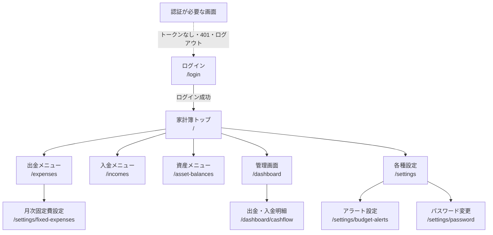
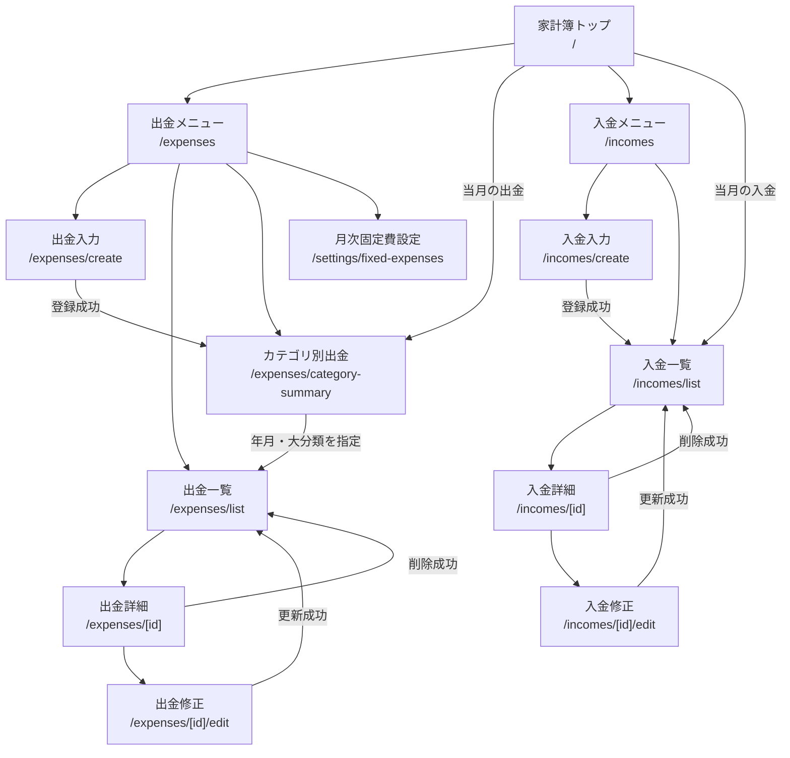
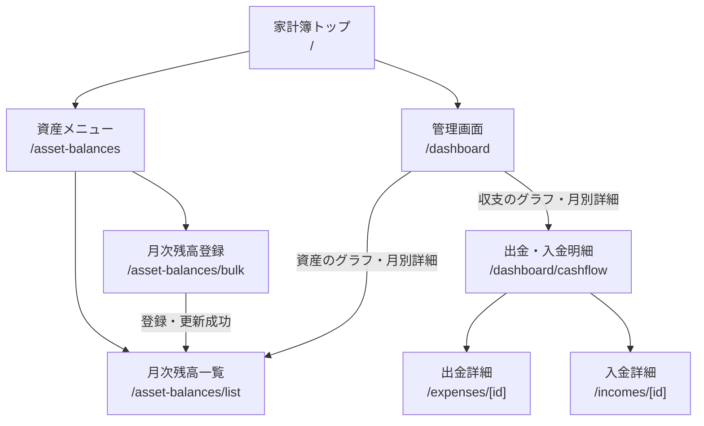
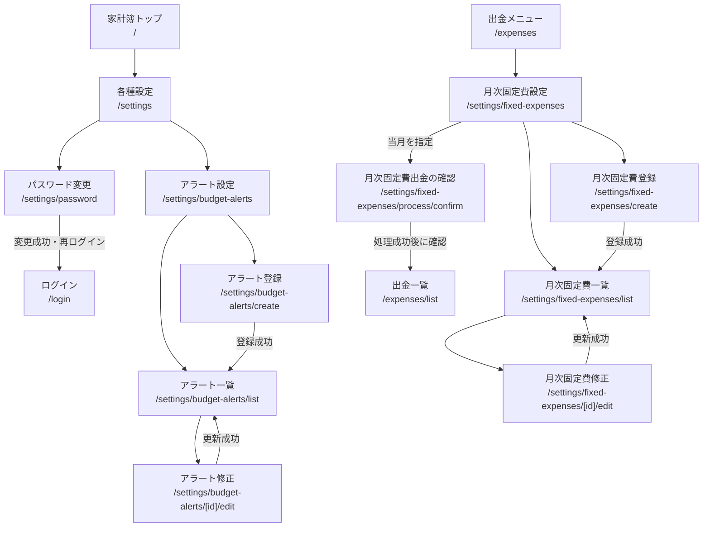

# 画面遷移図

## この資料について

この資料は、`src/app`のApp Router構成と、画面内のリンク・遷移処理を基にしたフロントエンドの画面遷移図です。

- URL中の`[id]`は、出金・入金・設定などのIDが入る動的セグメントです。
- `/login`以外はログイン後の利用を想定しています。
- 共通ヘッダーのログアウト、トークン未保存、APIからの`401 Unauthorized`は、いずれも最終的に`/login`へ遷移します。
- APIとの対応は[各画面とAPIの対応](./screen-api-mapping.md)、認証処理の詳細は[フロント側の認証フロー](./authentication-flow.md)を参照してください。

## 全体構成

## 出金・入金

## 資産・管理画面

## 設定・月次固定費

## URLクエリ

| 画面 | クエリ | 用途 |
| --- | --- | --- |
| `/expenses/list` | `year`, `month` | 表示する出金の年月を初期化 |
| `/expenses/list` | `groupId` | 大分類の絞り込みを初期化 |
| `/dashboard/cashflow` | `year`, `month` | 管理画面で選択した月の出金・入金明細を表示 |
| `/asset-balances/list` | `month=YYYY-MM` | 管理画面で選択した月の残高を表示 |
| `/settings/fixed-expenses/process/confirm` | `target_month=YYYY-MM` | 固定費を出金へ反映する対象月を指定 |

不正または不足している年月は、画面ごとの入力検証や現在年月への補正を経てAPIへ渡されます。
